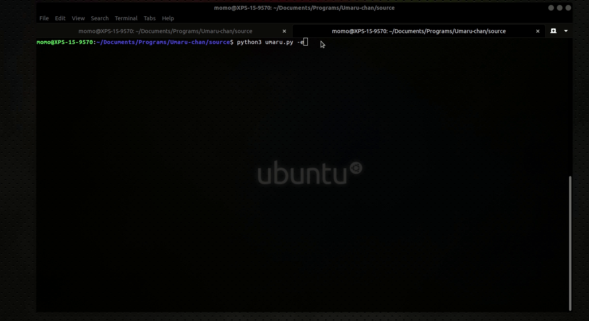

<b>*** This project was made with the intent of learning and by no means promotes piracy or illegal distribution of copyrighted content. We wanted to learn as well as have fun/ be motivated while doing so and anime was just one of the things we were passionate about and so, wanted to make something related to it. ***</b>

# Umaru-chan
A program to automate anime watching and downloading from [nyaa.si](https://nyaa.si/) based on release schedule.

## Description
The program is built particularly for seasonal anime watchers - people who watch weekly episodes of new shows every season. If you are not one of those people and just want to automate downloading shows in bulk, use the `-d/--download` parameter (Read below for more info)

## Installation
Clone this repository using:  
`git clone https://github.com/m0mosenpai/Umaru-chan.git` 
Create a virtual environment, preferably in Anaconda (pip might cause some issues in some windows machines), and run requirements.txt to install all dependencies 
`pip install -r requirements.txt` 
Run install.py and follow the prompts on screen.  
Enable `Automatically add .torrent files from <FOLDER>` in your torrent client - set the `<FOLDER>` to the `<T_PATH>`(set using -`t/--torrent`. Read usage below for more info) (**IMPORTANT**)(This is a one time setup) 
Leave the torrent client running in the background.

## Usage
* `umaru.py` allows you to set up various default parameters for your program: 
  * `-p/--path <PATH>` - Default anime storage libarary (Where you store all your anime files)
  * `-t/--torrent <T_PATH>` - Default download directory for .torrent files (This is where .torrent files will be downloaded)
  * `-q/--quality <QUALITY>` - Sets download quality for all episodes.(480p/ 720p/ 1080p)
  * `-a/--add <SHOWNAME>:<LAST_WATCHED_EPISODE>` - Adds one or more shows to your watchlist.
  * `-l/--list` - Displays your current locally saved watchlist.
  * `-r/--remove <INDEX_OF_SHOW>` - Removes one or more shows from the watchlist.
  * `-cl/--clr-list` - Clears watchlist.
  * `-cc/--clr-config` - Resets Config. (Use this if you encounter any JSON Decoding errors).
  * `-s/--status` - Displays all your set values and server status (if running)
  * __**__`-m/--mal-id <USER> <PASS>` - Sets MyAnimeList user and pass for automated list updation.
  * `-w/--watch` - Watch anime in your set PATH (from `-p`)
  * `-d/--download <START> <END>` - Download any anime in bulk in range START-END from nyaa/HS (This is to download any show separately if you don't care/don't watch shows regularly on a weekly basis every season)
  * `-e/--execute` - Runs the main scraper/server which downloads the anime.
  
  ** __Password is stored locally in plaintext form.__  
  
  
  
  
* Run `umaru.py -e` once a day (or set it up to run on startup) and it will automatically download the .torrent files based on release schedule and your watchlist, and store them in T_PATH (Set up using `-t/--torrent` parameter). On days when none of the shows in your watchlist air, it will simply exit. 
From there on, your torrent client will download all the episodes from the .torrent files.  
**IMPORTANT**: Make sure the download directory set in the torrent client is same as the PATH set using `-p/--path` (PATH to your anime library)

And that's it! To watch your download anime, run `umaru.py` with `-w/--watch` or if you want to download a show that's not airing this season, use `-d/--download`. 
### Automatic List Updation
Umaru-chan also supports automatic media detection and list updation. Run `media_detect.py` and set up MAL login credentials and it'll automatically detect which anime you are watching and update your list when you finish the episode. Most common file formats and media players are supported. Note that it only detects few supported media players by default. (Read below for other unrecognized media players).

### Automatic Media Player Detection
Open a media file with the player of your choice and run `autofind.py` to automatically detect the player and save it to the list of recognized media players processes. This is useful if a media player is not recognized by `media_detect.py` by default.

# Authors
Sarthak Khattar @[m0mosenpai](https://github.com/m0mosenpai)  
Ayush Singh @[prog-butter](https://github.com/prog-butter)

# License
MIT
